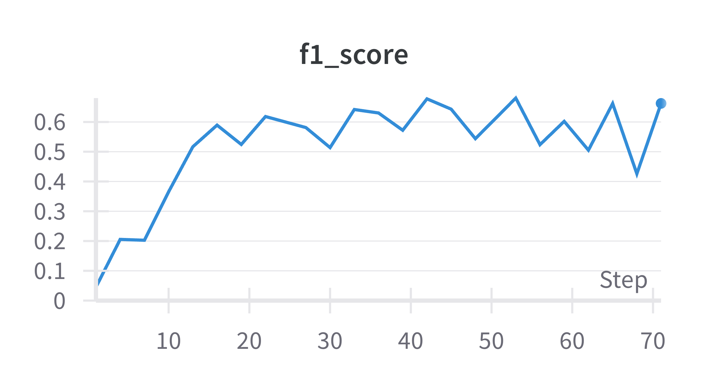
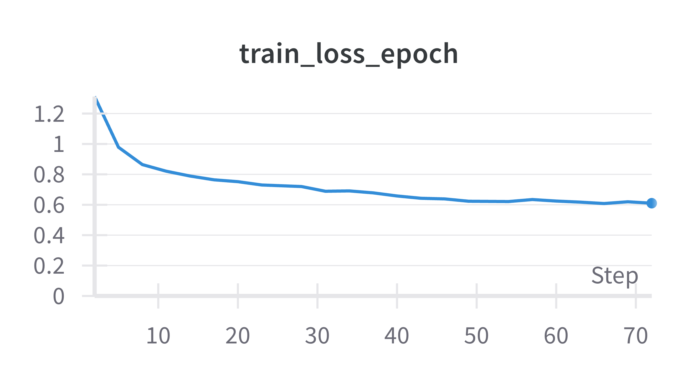
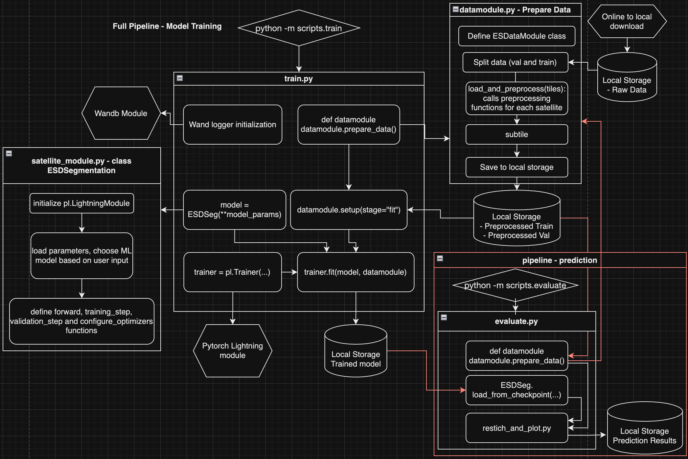

[](https://classroom.github.com/a/6ndC2138)

# Society and Electricity Satellite Segmentation: A comparison of UNet with DeepLabV3


The final project for UCI's CS 175: Project in Artificial Intelligence.

Developed by Brown Rice: [Levi Ramirez](https://github.com/Levi-Ramirez), [Shadi Bitaraf](https://github.com/ShadiBitaraf), [Vedaant Patel](https://github.com/Vedaantp), [Benjamin Wong](https://github.com/chiyeon)

## Goal
**Society and Electricity Satellite Segmentation** targets semantic segmentation, seeking to adapt & use multiple models to achieve high classification accuracy  on the IEEE GRSS 2021 Data Fusion Contest dataset. We will compare the performance of DeepLabV3 with ResNet-101 against a base UNet model.

## Links
- [Presentation Video](https://drive.google.com/file/d/1YdW6rR6Sz3B7gmHiJ_T-qmvrKQmNhJTZ/view?usp=drive_link) (4:58) 
- [Presentation Slides](https://docs.google.com/presentation/d/1m1j8AbW45G5winhdcOWOZE1Pqv9NMdlVqWHvgyn3Nds/edit?usp=drive_link)
- [Technical Memorandum](https://docs.google.com/document/d/1BZ-9eep69z8YbXZpjtSkoP2Gme51i3fY3ekawlDdacY/edit?usp=sharing)
- [Project Poster](https://docs.google.com/presentation/d/1s1OpdS_f0XRhgllhzwgc2pmB7fn-TECbbmF9jXd8tl0/edit?usp=drive_link)

## Project Overview/Architecture
**Society and Electricity Satellite Segmentation** is powered by PyTorch & PyTorch Lightning, with a "from-scratch" UNet implementation and PyTorch's DeepLabV3 models.

### Directory
**NOTE: Some directories/files are followed by another name in quotations to assist in project assignment name verification.**
- `assets/`: 'data_folder' - Visual graphics for documentation purpose
- `data/`: Initially empty, contains `raw/` dataset folder. More details are included in [Getting Started](#getting-started) below
- `models/`: 'model folder' - contains checkpoints after each model run. Also contains a text file linking to author's best models.
- `scripts/`: Runnable Python scripts for evaluation & training
    - `evaluate.py`: Loads model from a checkpoint file & plots graphic, comparing the ground truth with the prediction
    - `evaluate_kaggle.py`: Creates CSV file for test dataset evaluation on Kaggle
    - `sweeps.yml`: Sweeps configuration file that specifies different attributes and their accepted ranges/values
    - `train.py`: Script to conduct model training. If images aren't preprocessed, they will be processed & stored in the `data/` folder
    - `train_sweepys.py`: Similar to `train.py` but conducts wide array of iterative runs with different hyperparameters based on `sweeps.yml`
- `src/`: Contains necessary modules & source code for models, preprocessing, visualization, & training
    - `esd_data/`: Definitions & handlers for the dataset, including augmentations and logic for loading and handling
        - `agumentations.py`: 'transformations' - provides functions for augmentations
        - `datamodule.py`: 'data module' - manages training, validation, and testing dataloaders, as well as steps that may be required for transformations
        - `dataset.py`: 'dataset class' - PyTorch Dataset class definition for creating batches in a DataLoader
    - `models/supervised/`: Definitions for several PyTorch compatible models for training on the IEEE GRSS dataset. Of note, there are:
        - `segmentation_cnn.py`: Defines a basic CNN that performs segmentation
        - `resnet_transfer`: Defines the FCNResnetTransfer class which loads the fcn_resnet101 model from torch hub and applies modificiations
        - `unet.py`: "From scratch" UNet implementation
        - `deepLabV3.py`: Wrapper for PyTorch's DeepLabV3 with ResNet-101 backbone & pretrained weights
        - `satellite_module.py`: Baseline class to help load proper model & parameters, abstracting to a single "satellite" class
    - `preprocessing/`: Necessary functions & files for preprocessing data, including applying augmentations/transformations and seperating these images into subtiles
        - `file_utils.py`: 'dataloader'- defines a module for loading satellite imagery into data structures using the package [xarray](https://docs.xarray.dev/en/latest/index.html).
        - `preprocess_sat.py` 'data_utils' - is a module to preprocess satellite imagery by performing image enhancement and normalization techniques to prepare the data for exploratory data analysis and visualization using matplotlib.
        - `subtile.py` 'data_utils' - defines a class containing functions enabling the subtiling of satellite images
    - `visualization/`: Necessary functions & files for visualizing data, including applying augmentations/transformations and seperating these images into subtiles
        - `plot_utils.py` - includes a series of functions to visualize the data from different satellites
        - `restich_plot.py` - contains functions to assist in restiching subtiles back together
    - `utilities.py`: Definition for basline `ESDConfig` class which specifies necessary parameters for training, including directories, valid satellite bands in the dataset, and hyperparameters like max_epochs & learning rate.
- `requirements.txt`: requirments file for reproducing the analysis environment.

### Functionality
For training to work, the downloaded IEEE GRSS dataset must be present in the `data/raw/` folder. The training script will check for the presence of preprocessed tiles (which are placed in `data/processed/`), preprocessing all necessary resources if missing.

Once preprocessed, the training script needs an `ESDConfig` to run, the default of which is located in the `src/utilities.py` file. In order to change hyperparameters like the model type, batch size, max epochs and more, the default `ESDConfig` can be changed or command-line arguments like `--model_type` can be inputted when running the training script.

With the proper data loaded & parameters/model set, training can now begin. Connecting to Weights & Balances, the training script will output the results of each epoch to `wandb.ai`, allowing progress to be visible even away from the local machine.

Once training is complete, a `models/` folder should have been created, containing the saved weights in a `last.ckpt` checkpoint file. Note that **due to the file size of our best performing model's `last.ckpt` file, we will be linking it here in this README,** in the [Models section](#models). The trained model can further be evaluated with the `evaluate.py` and `evaluate_kaggle.ply` scripts.

## Installation

The code requires `python>=3.11.3`, as well as `pytorch>=2.3` and `torchvision>=0.18`. Please follow the instructions [here](https://realpython.com/installing-python/) to install both python if you don't have it installed already. All other dependencies (including pytorch) will be installed using the following steps:

1. Clone this repository locally and install with

`git clone https://github.com/cs175cv-s2024/final-project-brown-rice.git`

2. (RECOMMENDED) We recommend using a virtual environment in order to have a reproducible and stable envrionment.

   (a) Create a virtual environment: `python3 -m venv esdenv`

   (b) Activate the virtual environment:
   * On macOS and Linux: `source esdenv/bin/activate`
   * On Windows: `.\esdenv\Scripts\activate`

3. Install the required packages and dependencies:
   `pip install -r requirements.txt`

To deactivate a virtual environment, type `deactivate` in the command line.

## Getting Started

### Step 1: 
Use Wandb for experiment tracking, visualization, and collaboration in this project. Setup your account using the [Quickstart guide](https://docs.wandb.ai/quickstart).
1. Run `wandb login` in the command line
2. Input W&B API key into the prompt. If you don't have an account, you'll need to sign up first on their website. Once you've logged in and authenticated your account, you can start using Wandb to track the weights and biases of your ML runs.
3. Input your project name associated with your account in train.py in the line with the function wandb.init(project="PROJECT_NAME"), replacing PROJECT_NAME with the name of your project.


### Step 2:
You can download the dataset [here](https://drive.google.com/file/d/1mVDV9NkmyfZbkSiD5lkskv_MwOuYxiog/view). Download the dataset, place it in a directory called `data/raw`. The full path after download and placing the data here should be `data/raw/Train`.

### Step 3:
Now you should be ready to run the commands to train the models on this dataset. Look at the [Training](#training)
 section below to see the training commmand options.

## Models 
### UNet
**[Best Model](https://drive.google.com/file/d/1Nq5NvRo5cQajUyJg_8U_PvhVcx1o4Vsi/view?usp=sharing)**

This model uses what is called a "skip connection", these are inspired by the nonlinear nature of brains, and are generally good at helping models "remember" informatiion that might have been lost as the network gets longer. These are done by saving the partial outputs of the networks, known as residuals, and appending them later to later partial outputs of the network. In our case, we have the output of the inc layer, as the first residual, and each layer but the last one as the rest of the residuals. Each residual and current partial output are then fed to the Decoder layer, which performs a reverse convolution (ConvTranspose2d) on the partial output, concatenates it to the residual and then performs another convolution. At the end, we end up with an output of the same resolution as the input, so we must MaxPool2d in order to make it the same resolution as our target mask.


### DeepLabV3
**[Best Model with L1 Regularization](https://drive.google.com/file/d/1iYFRmWli05z9RiQW2VO0fvd8w785tKpV/view?usp=sharing)**
**[Best Model without L1 Regularization](https://drive.google.com/file/d/1VJdZUyBr2BGWGcf2VH06i1DrMR4aIqIM/view?usp=sharing)**

DeepLabV3 was designed specifically for semantic image segmentation, and this project's version employs a ResNet-101 backbone and pretrained weights. Similar to UNet, DeepLabV3 also utilizes an Encoder-Decoder architecture in combination with several other techniques like Atrous Convolution and Atrous Spatial Pyramid Pooling in order to maximize the capturing of data context over several scales. This ensure the model can both capture & consider finer details and broader patterns, assisting in segmentation. Another strength of this model is the ResNet-101 backbone, which also makes use of skip connections in order to assist in training. Specifically for DeepLabV3, ResNet is used as a feature extractor in an initial part of the network, with those details passed further down the DeepLabV3 architecture.


Graphic from [DeepLabV3 Ultimate Guide](https://learnopencv.com/deeplabv3-ultimate-guide/)

## Performance
### UNet
The UNet model performed well and achieved an accuracy high of 67% on the validation set. For run 1 through 4 in the table, Sentinel 1 and Sentinel 2 bands were used. For run 5, Sentinel 1, Sentinel 2, VIIRS, and VIIRS MAX Projection were used. For run 6, all bands were used.

 




 


 




**Note:** The F1 score was set to be logged later on in the sweeps that were ran, so some of the runs do not include an F1 score.

| Epochs | F1 Score | Training Accuracy | Training Loss | Validation Accuracy | Validation Loss | Embedding Size | In Channels | Learning Rate | N Encoders |
| ------ | -------- | ----------------- | ------------- | ------------------- | --------------- | -------------- | ----------- | ------------- | ---------- |
| 5 | NA | 0.59 | 0.84 | 0.56 | 0.90 | 128 | 56 | 0.002917 | 5 |
| 5 | NA | 0.65 | 0.8 | 0.61 | 0.98 | 64 | 56 | 0.07799 | 4 |
| 10 | NA | 0.67 | 0.77 | 0.63 | 0.88 | 32 | 56 | 0.0529 | 5 |
| 10 | NA | 0.68 | 0.75 | 0.64 | 0.88 | 256 | 56 | 0.08564 | 5 |
| 25 | 0.58 | 0.66 | 0.79 | 0.62 | 0.91 | 64 | 66 | 0.08762 | 4 |
| 25 | 0.66 | 0.72 | 0.61 | 0.69 | 0.83 | 256 | 99 | 0.0005 | 5 |


### DeepLabV3
DeepLabV3 also performed well, but overall ended barely short of the results from UNet. Still, DeepLabV3 peaked at a validation accuracy of 72% with regularization.


The above results are from training with L1 Regularization across 150 epochs


The above results are from training without L1 Regularization across 150 epochs


| Epochs | F1 Score | Training Loss | Validation Accuracy | Validation Loss |
| ------ | -------- | ------------- | ------------------- | --------------- |
| 1 | 0.42 | 214.71 | 0.55 | 1.11 |
| 50 | 0.59 | 2.32 | 0.63 | 0.87 |
| 100 | 0.64 | 1.74 | 0.65 | 1.17 |
| 125 | 0.46 | 1.64 | 0.66 | 0.95 |
| 150 | 0.62 | 1.54 | 0.63 | 0.94 |

Above results are from training on optimal parameters over 150 epochs with L1 Regularization

## Dataset

The datasets used in this project are derived from the IEEE GRSS 2021 Data Fusion Contest. The dataset comprises satellite imagery data from multiple satellites, each with unique characteristics and data types. For more information, visit the [IEEE GRSS Data Fusion Contest page](https://www.grss-ieee.org/community/technical-committees/2021-ieee-grss-data-fusion-contest-track-dse/). You can download the dataset [here](https://drive.google.com/file/d/1mVDV9NkmyfZbkSiD5lkskv_MwOuYxiog/view)

### The dataset includes:
### Sentinel-1 Polarimetric SAR Dataset

- Channels: 2 (VV and VH polarization)
- Spatial Resolution: 10m (resampled from 5x20m)
- File Name Prefix: S1A*IW_GRDH*.tif
- Size: 2.1 GB (float32)
- Number of Images: 4
- Acquisition Mode: Interferometric Wide Swath
- More Info: [User Guide](https://sentiwiki.copernicus.eu/web/s1-applications)

<!--  -->


### Sentinel-2 Multispectral Dataset

- Channels: 12 (VNIR and SWIR ranges)
- Spatial Resolution: 10m, 20m, and 60m
- File Name Prefix: L2A\_\*.tif
- Size: 6.2 GB (uint16)
- Number of Images: 4
- Level of Processing: 2A
- More Info: [Technical Guide](https://sentiwiki.copernicus.eu/web/s2-processing), [User Guide](https://sentiwiki.copernicus.eu/web/s2-applications)


### Landsat 8 Multispectral Dataset

- Channels: 11 (VNIR, SWIR, TIR, and Panchromatic)
- Spatial Resolution: 15m, 30m, and 100m
- File Name Prefix: LC08*L1TP*.tif
- Size: 8.5 GB (float32)
- Number of Images: 3
- Sensors Used: OLI and TIRS
- More Info: [Landsat 8 Overview](https://landsat.gsfc.nasa.gov/satellites/landsat-8/), [User Handbook](https://www.usgs.gov/landsat-missions/landsat-8-data-users-handbook)

<!--  -->


### Suomi NPP VIIRS Nighttime Dataset

- Channels: 1 (Day-Night Band - DNB)
- Spatial Resolution: 500m (resampled from 750m)
- File Name Prefix: DNB*VNP46A1*.tif
- Size: 1.2 GB (uint16)
- Number of Images: 9
- Product Name: VNP46A1
- More Info: [User Guide](https://viirsland.gsfc.nasa.gov/PDF/VIIRS_BlackMarble_UserGuide.pdf)

<!--  -->


### Semantic Labels

The training data is split across 60 folders named TileX, where X is the tile number. Each folder includes 100 files, with 98 corresponding to the satellite images listed above. Reference information ("groundTruth.tif" file) for each tile includes labels for human settlement and electricity presence. The labeling is as follows:

1. Human settlements without electricity: Color ff0000
2. No human settlements without electricity: Color 0000ff
3. Human settlements with electricity: Color ffff00
4. No human settlements with electricity: Color b266ff

An additional reference file (groundTruthRGB.png) is provided at 10m resolution in RGB for easier visualization in each tile, as shown below.

<!--  -->


## Training
We will train the models using the model architectures defined in the [Models](#models) section in conjunction with the PyTorch Lightning Module for ease of implementation of the training process. Model training will be monitored using Weights & Biases (as signed up for in the [Getting Started](#getting-started) section).

### `ESDConfig` Python Dataclass
In `src/utilities.py` we have created an `ESDConfig` dataclass to store all the paths and parameters for experimenting with the training step. These default parameters can be overwritten with added options when executing `scripts.train` in the command line.
- To get a list of the options, run this command: `python -m scripts.train -help`

For example, if you would like to run training for the architecture UNet for seven epochs you would run:

`python -m scripts.train --model_type=UNet --max_epochs=7`

### Hyperparameter Sweeps
- `sweeps.yml` is used to automate hyperparameter search over metrics such as batch size, epochs, learning rate, and optimizer.

- To run training with the hyperparameter sweeps you define in `sweeps.yml`, run `python scripts/train_sweeps.py --sweep_file=scripts/sweeps.yml`

- These sweeps will be logged in your wandb account

- To run sweeps on a differnt model, change the MODEL name in `src/utilities.py`. Current default is UNet

   example:

      MODEL = 'MODEL_NAME'

## Pipeline
Full machine learning pipeline + evaluate.py pipeline


## Liscense

This project is licensed under the [MIT License](LICENSE)

## Contributers / Authors

[Levi Ramirez](https://github.com/Levi-Ramirez),
[Shadi Bitaraf](https://github.com/ShadiBitaraf),
[Vedaant Patel](https://github.com/Vedaantp),
[Benjamin Wong](https://github.com/chiyeon)

## References

[Overview of Semantic Segmentation](https://www.jeremyjordan.me/semantic-segmentation/)

[Cook Your First UNET in Pytorch](https://towardsdatascience.com/cook-your-first-u-net-in-pytorch-b3297a844cf3)

[Pytorch DeepLabV3](https://pytorch.org/vision/main/models/deeplabv3.html)

[HW03: Semantic Segmentation and Model Monitoring](https://github.com/cs175cv-s2024/hw3-semantic-segmentation-brown-rice)

[Wandb Quickstart](https://docs.wandb.ai/quickstart)

[DeepLabV3 Ultimate Guide](https://learnopencv.com/deeplabv3-ultimate-guide/) - Resource for learning & graphics

## Citing this project

If you use **Society and Electricity Satellite Segmentation: A comparison of UNet with DeepLabV3** in your research, please use the following BibTeX entry:

```bibtex
@misc{final-project-brown-rice,
  title={Society and Electricity Satellite Segmentation: A comparison of UNet with [a select model: TBD]},
  author={Bitaraf, Shadi and Patel, Vedaant and Ramirez, Levi and Wong, Benjamin},
  howpublished = {\url{https://github.com/cs175cv-s2024/final-project-brown-rice}},
  year={2024}
}
